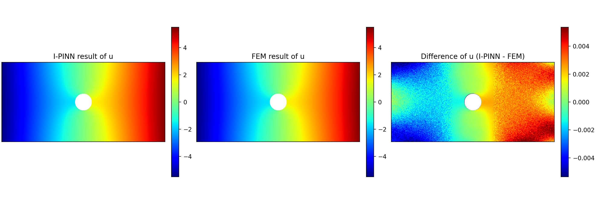
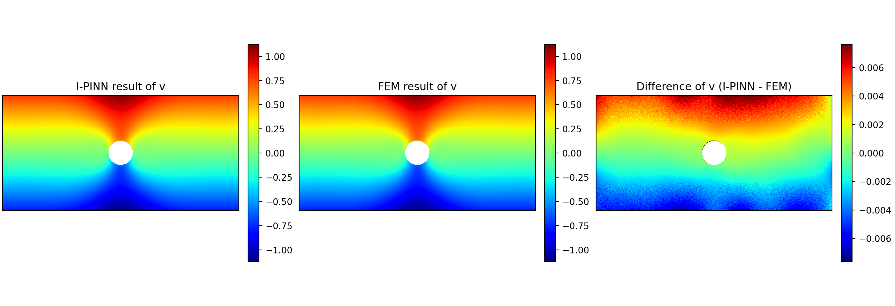
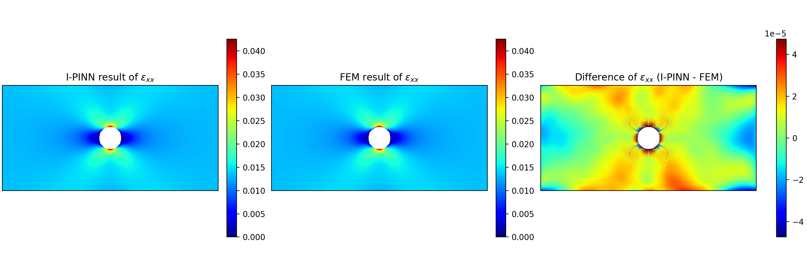
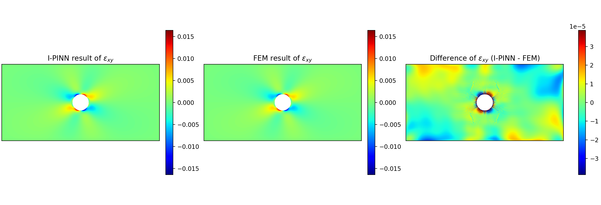
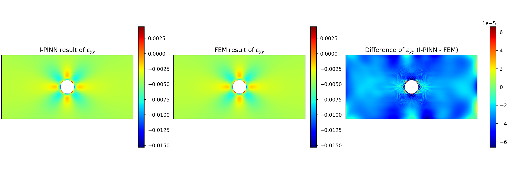
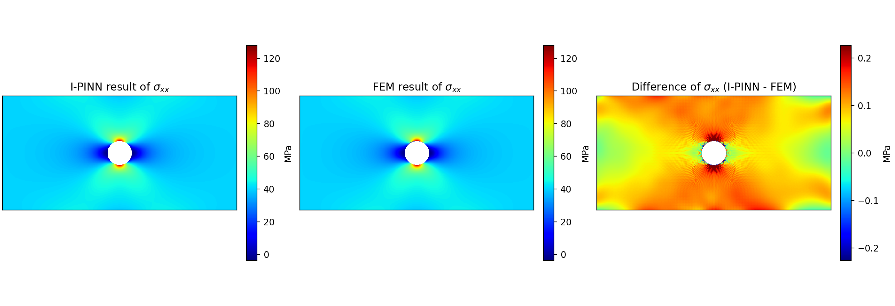
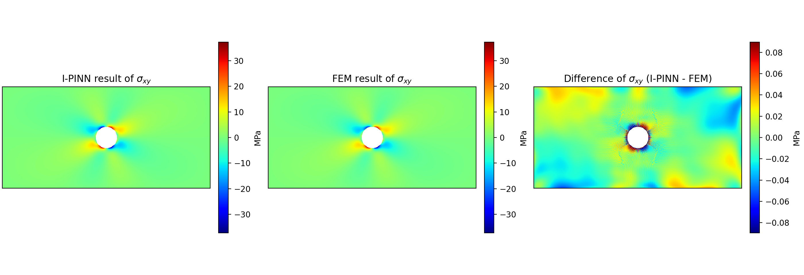
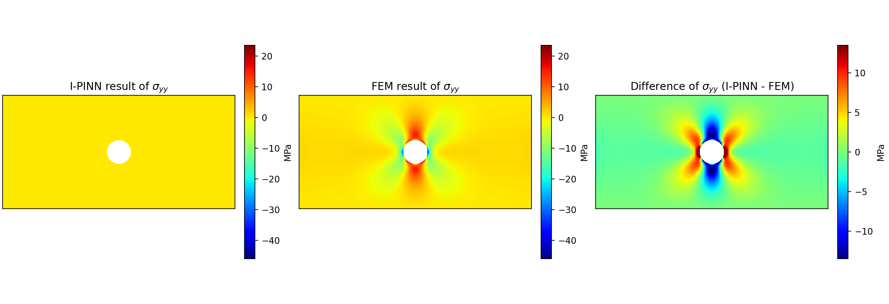

# I-PINN Framework

Open-source implementation of **A unified image-driven physics-informed learning framework for mechanical field reconstruction and material identification**.

This repository is organized as a reusable **I-PINN framework**:

- the framework core combines image matching and physics constraints in a two-stage inverse workflow,
- the case definition provides geometry, dimensions, coordinates, targets, weights, and reference conventions,
- the network backbone is injected as a separate model component,
- the packaged single-hole benchmark is provided as the first validated example case built on top of this framework.

This release contains:
- the reusable I-PINN framework code,
- one ready-to-run sample case,
- FEM reference data for quantitative evaluation,
- final prediction results from a validated full run,
- comparison figures between I-PINN and FEM.

## Repository layout

- `code/`: framework core, case definitions, model code, training, evaluation, and plotting scripts
- `example_case/`: sample speckle images and FEM reference fields
- `results/`: final predicted fields, metrics, and comparison figures
- `requirements.txt`: Python dependencies

## Environment requirements

The Python workflow in this package was tested with:

- Python `3.11`
- `numpy==1.23.5`
- `torch==2.7.0`
- `matplotlib==3.10.0`
- `seaborn==0.13.2`
- `opencv-python==4.11.0.86`
- `tensorboard==2.19.0`

Install the tested Python dependencies with:

```bash
pip install -r requirements.txt
```

Notes:

- `torch==2.7.0` is listed without a CUDA suffix in `requirements.txt`; install the CPU or CUDA build that matches your local machine.
- A GPU is recommended for full training, but the evaluation and figure-generation scripts can also run on CPU.
- `code/plot_single_hole_results.m` is optional and requires MATLAB. The Python workflow does not depend on MATLAB.

## Quick start

Run the packaged single-hole case through the framework entry script:

```bash
python code/run_single_hole_inverse.py --case-dir example_case
```

The default run keeps the material parameters fixed at the single-hole FEM values.
Enable inverse identification only when you want to solve for `E` and `nu`:

```bash
python code/run_single_hole_inverse.py --case-dir example_case --invert-material
```

Select the hidden-layer activation, backbone, or inverse-material mode explicitly if needed:

```bash
python code/run_single_hole_inverse.py --case-dir example_case --activation gelu
python code/run_single_hole_inverse.py --case-dir example_case --activation tanh
python code/run_single_hole_inverse.py --case-dir example_case --model-name resnn
python code/run_single_hole_inverse.py --case-dir example_case --model-name plainnn --invert-material
```

Evaluate the predicted fields against the FEM reference:

```bash
python code/evaluate_single_hole.py --pred-dir results --ref-dir example_case
```

Regenerate the final comparison figures:

```bash
python code/export_comparison_figures.py --pred-dir results --ref-dir example_case --out-dir results/final_comparison_figures
```

A MATLAB plotting version is also provided in:

- `code/plot_single_hole_results.m`

## Framework overview

The current code separates four roles:

- `framework.py`: generic I-PINN training workflow, checkpointing, and target-based stage-2 weighting
- `cases.py`: case-specific geometry, sampling, constraint coordinates, targets, and metadata
- `model.py` and `materials.py`: network backbone and fixed/trainable material parameter modules
- `constraints.py`: generic image, boundary, equilibrium, and energy loss formulas

The packaged benchmark uses `SingleHoleCase`, but the framework is prepared for future cases by passing the following information through the case object:

- input images
- geometry and dimensions
- boundary-condition definitions
- constraint coordinates and target values
- equilibrium and energy sampling data
- reference files and evaluation conventions

Likewise, the neural network and the material-parameter mode are passed into the trainer as pluggable components.

## Constraint and material design

The public framework uses a generic loss structure:

- the **loss formulas** are fixed in `constraints.py`,
- the **case** provides the coordinates, targets, and enabled status for each constraint,
- the **trainer** only aggregates the registered raw losses and applies target-based stage-2 weights.

The packaged single-hole case registers the following constraints:

- image warp loss
- displacement boundary-condition loss
- outer stress boundary-condition losses
- hole traction-free loss
- inner equilibrium loss
- energy consistency loss

For the packaged single-hole benchmark, these constraints are attached to the
physical case as follows:

- left and right outer edges: prescribed horizontal displacement and non-zero normal traction,
- top and bottom outer edges: traction-free boundaries,
- circular hole boundary: traction-free boundary,
- plate interior outside the hole: stress-equilibrium collocation points,
- valid speckle pixels outside the hole: image-warp constraint,
- perforated plate domain plus loaded outer edges: energy-consistency term.

The generic framework keeps the displacement-boundary loss available, but the
validated single-hole inverse benchmark leaves this term disabled and instead
uses the image, traction, equilibrium, and energy constraints as the active
stage-2 configuration.

Material handling supports two modes:

- **fixed mode**: default for the public example
- **inverse mode**: enabled with `--invert-material`

In fixed mode, the case passes the benchmark FEM values of Young's modulus and
Poisson's ratio directly into the framework. In inverse mode, these two
parameters are added to the trainable variable set and exported as identified
material properties at the end of training.

## Included example

The packaged example is organized as follows:

- `example_case/re001.bmp`, `example_case/tar001.bmp`: input speckle images
- `example_case/u001.csv`, `v001.csv`: FEM displacement fields
- `example_case/strain_*.csv`, `stress_*.csv`: FEM strain and stress fields
- `example_case/case_metadata.json`: case metadata used by the evaluation and plotting scripts
- `results/`: final I-PINN outputs from a validated full training run

This example is a **single-hole plate under tensile loading** and is included
only as a compact, ready-to-run benchmark for demonstrating how the generic
framework is configured and evaluated.

## Final quantitative results

The validated full-run metrics are stored in:

- `results/metrics_summary.json`
- `results/identified_parameters.json`

The packaged final results were generated in **inverse mode**, so the published
material values in `results/` are marked with `source: "inferred"`.

Key results:

- `E_pred = 2.9971`
- `Poisson's ratio_pred = 0.3221`
- `E_error = -0.00288`
- `Poisson's ratio_error = +0.00213`
- `u_rmse = 0.02398`
- `v_rmse = 0.00926`
- `epsilon_xx local rmse = 0.002849`
- `epsilon_xy local rmse = 0.001155`
- `epsilon_yy local rmse = 0.001138`
- `sigma_xx local rmse = 8.775 MPa`
- `sigma_xy local rmse = 2.618 MPa`
- `sigma_yy local rmse = 2.938 MPa`

## Example result preview

The packaged single-hole example already includes the final predicted fields,
the FEM reference fields, and the corresponding signed difference fields. This
lets the repository homepage show what the method actually computes before a
user runs the code locally.

**Displacement `u`**



**Displacement `v`**



**Strain `ε_xx`**



**Strain `ε_xy`**



**Strain `ε_yy`**



**Stress `σ_xx`**



**Stress `σ_xy`**



**Stress `σ_yy`**



## Visual comparison with FEM

The final comparison figures are stored in:

- `results/final_comparison_figures/`

Each figure contains:
- I-PINN prediction
- FEM reference
- signed difference field `(I-PINN - FEM)`

Available figures:

- `compare_u.png`
- `compare_v.png`
- `compare_exx.png`
- `compare_exy.png`
- `compare_eyy.png`
- `compare_sxx.png`
- `compare_sxy.png`
- `compare_syy.png`

Display conventions:

- the hole is masked as a white void region,
- the I-PINN and FEM panels share the same color range,
- the third panel shows the signed difference field.

## Evaluation notes

- `u` and `v` are evaluated by full-field MAE/RMSE outside the hole.
- strain and stress components are evaluated on both the full perforated plate and the annular neighborhood `R <= r <= 1.5R`.
- `strain_xy001.csv` from FEM is the engineering shear strain `gamma_xy`; the evaluation and plotting scripts convert it to the tensor shear strain `epsilon_xy = gamma_xy / 2` before comparison.
- predicted stresses may be stored either in normalized GPa-scale variables or already in Pa; the scripts detect this automatically from the magnitude.
- `identified_parameters.json` records whether the exported material values came from fixed mode or inverse mode.

## Manuscript-code notes

This release follows the **validated code behavior** of the packaged benchmark.

- The code supports both `gelu` and `tanh` activations and defaults to `gelu`.
- The stage-2 weights are implemented using a target-based static weighting strategy calibrated to recover the validated single-hole scale.
- The framework keeps the validated single-hole stage-2 ramp hook, but the concrete geometry, targets, and enabled constraints are provided by the case object rather than hard-coded in the trainer.
- The public CLI defaults to fixed material parameters; inverse identification is opt-in.

## Scope of this release

Included:
- reusable I-PINN framework
- sample data
- evaluation script
- plotting scripts
- validated final results
